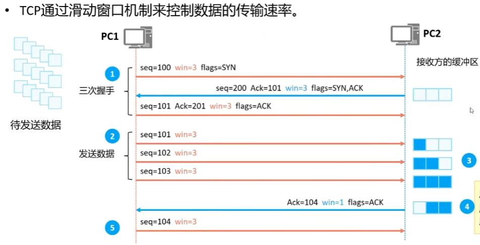

# 
数通HCIP

## TCP三次握手机制
###  滑动窗口机制
在三次握手环节，发送方与接收方协商输数据大小。你可以想象一个具体的过程：发送方（PC1）向接收方（PC2）协商每次传输3个数据，接收方同意，接下来发送方连续传输3个数据（seq=101、102、103），期间不必等待接收方的ACK确认。这个时候，数据分为已发送已收到ACK数据、已发送未收到ACK数据、可以发送但还没有发送数据，不能发送数据，其中第二、三种数据便为窗口。

## TCP/IP主要协议
- Telnet、FTP、TFTP、SNMP、HTTP、SMTP、DNS、DHCP
- TCP、UDP
- ICMP、IGMP、IP
- PPPoE、Ethernet、PPP

## OSPF协议
***是一种基于链路状态的内部网关协议***。目前针对IPv4协议使用的是OSPF Version 2(RFC2328);针对IPv6协议使用OSPF Version 3(RFC2740)。

-----
### 工作过程
- Down
- Init
- 2-way
- ExStart
- Exchange

### LSA类型
- Router LSA
- Network LSA
- 
