# Linux 速成

> 面向**网络安全攻防工程师 / 渗透测试工程师**的 Linux 知识整理。
> 主线是「能操作 → 懂原理 → 会加固 → 可对抗」，安全加固部分按等保与基线核查的思路组织，每条都给出**检查命令**和**修复动作**。
>
> 约定：命令同时兼顾 RHEL 系（CentOS / Rocky / Alma，包管理 `dnf`）与 Debian 系（Ubuntu / Kali / Debian，包管理 `apt`），差异处会标注。所有涉及对抗的命令**仅在授权环境使用**。



---

## 目录

- [1. 什么是 Linux](#1-什么是-linux)
- [2. Shell 与命令基础](#2-shell-与命令基础)
- [3. 文件系统与目录结构](#3-文件系统与目录结构)
- [4. 文件操作与文本处理](#4-文件操作与文本处理)
- [5. 用户与组管理](#5-用户与组管理)
- [6. 文件权限管理](#6-文件权限管理)
- [7. 网络与系统管理](#7-网络与系统管理)
- [8. Linux 安全加固](#8-linux-安全加固)
- [9. 攻防视角速查](#9-攻防视角速查)
- [10. 命令速查表](#10-命令速查表)
- [附录 A：原框架修订说明](#附录-a原框架修订说明)

---

## 1. 什么是 Linux

### 1.1 内核与发行版

严格说 **Linux 只是内核**，我们日常说的 Linux 是「内核 + GNU 工具 + 桌面/服务软件」打包成的**发行版**。内核负责进程调度、内存管理、文件系统、网络协议栈和设备驱动；用户态的一切（Shell、命令、服务）都跑在它之上。

| 家族 | 代表 | 包管理 | 安全从业者常用场景 |
| --- | --- | --- | --- |
| RHEL 系 | RHEL、CentOS、Rocky、Alma、Fedora | `rpm` / `yum` / `dnf` | 生产服务器、等保基线核查 |
| Debian 系 | Debian、Ubuntu、Kali | `dpkg` / `apt` | Kali 做攻击机、Ubuntu Server 搭靶场 |
| 独立/轻量 | Arch、Alpine、OpenSUSE | `pacman` / `apk` / `zypper` | 容器镜像（Alpine 常见于镜像基线） |

快速确认当前系统：

```bash
cat /etc/os-release        # 发行版与版本
uname -a                   # 内核版本、架构、编译时间
uname -r                   # 只看内核版本（提权漏洞比对用）
hostnamectl                # systemd 系统的概览
```

### 1.2 分层结构

```
应用程序   (nginx / sshd / python ...)
    ↓ 调用库与系统调用
Shell/工具 (bash、coreutils) —— 你敲命令的地方
    ↓
内核       (进程、内存、文件系统、网络、驱动)
    ↓
硬件
```

### 1.3 一切皆文件

Linux 把几乎所有资源抽象成文件，这一点在排查时非常有用：

| 对象 | 表现 |
| --- | --- |
| 普通文件/目录 | `-` / `d` |
| 设备 | `/dev/sda`、`/dev/null` |
| 进程信息 | `/proc/<PID>/`（`cmdline`、`environ`、`fd/`、`exe`） |
| 内核参数 | `/proc/sys/...`（`sysctl` 的本质） |
| 套接字 | Unix socket 也以文件形式存在 |

---

## 2. Shell 与命令基础

### 2.1 Shell 是什么

Shell 是**命令解释器**，你输入的命令由它解析后交给内核。常见的是 `bash`，还有 `zsh`、`sh`（POSIX 最小实现）。

```bash
echo $SHELL              # 当前默认 Shell
cat /etc/shells          # 系统允许的登录 Shell（也用于判断账户能否登录）
bash --version
```

### 2.2 查帮助

```bash
man ls                   # 手册（q 退出，/keyword 搜索）
ls --help                # 简要用法
type ls                  # 判断是内置命令、外部命令还是别名
which ls / whereis ls    # 定位命令文件
help cd                  # 内置命令专用
```

> `type` 比 `which` 更准：别名、函数、`which` 自己查不出来。

### 2.3 路径、通配符与引号

```bash
cd /etc                 # 绝对路径
cd ../log               # 相对路径（. 当前，.. 上级，~ 家目录，- 上一次目录）
pwd
ls *.conf               # * 任意多字符
ls ?.conf               # ? 单个字符
ls [abc]*               # [] 字符集合
```

引号差异必须分清：

```bash
echo "$PATH"            # 双引号：变量会被展开
echo '$PATH'            # 单引号：原样输出
echo `date`             # 反引号：执行命令（推荐写成 $(date)）
echo "today is $(date)"
```

### 2.4 管道、重定向与 xargs

```bash
cat access.log | grep "404" | wc -l     # 管道：前一个的输出做后一个的输入
ls > file.txt                            # 覆盖写
ls >> file.txt                           # 追加写
cmd 2> err.log                           # 只重定向 stderr
cmd > all.log 2>&1                       # stdout+stderr 一起重定向
cmd > /dev/null 2>&1                     # 丢弃一切输出
cmd | tee out.log                        # 一边显示一边保存
find . -name "*.log" | xargs rm -f       # 把标准输入变成参数
find . -name "*.log" -print0 | xargs -0 rm -f   # 处理含空格的文件名
```

> **安全点：PATH 劫持。** 命令执行顺序取决于 `$PATH` 中目录的先后。若 `.`（当前目录）或某个可写目录排在前面，攻击者放一个同名 `ls`、`ps` 就能劫持执行。检查：`echo $PATH`，确认没有 `.` 和可写目录；排查 `/usr/local/bin` 下的可疑文件。

---

## 3. 文件系统与目录结构



### 3.1 必须记住的目录

| 目录 | 用途 | 安全关注 |
| --- | --- | --- |
| `/etc` | 系统与服务配置 | 加固主战场，权限必须严格 |
| `/etc/shadow` | 密码哈希 | 000 或 600，只允许 root 读 |
| `/var/log` | 日志 | 外发 + 留存 180 天 |
| `/var/spool/cron` | 用户计划任务 | 权限维持高发地 |
| `/home`、`/root` | 家目录 | 700/750；查 `.ssh/authorized_keys` |
| `/tmp`、`/dev/shm` | 临时目录、共享内存 | 建议 `nosuid,nodev,noexec` |
| `/proc`、`/sys` | 虚拟文件系统 | 进程信息与内核参数入口 |
| `/bin`、`/usr/bin` | 系统命令 | 完整性校验 `rpm -V` / `dpkg -V` |
| `/usr/local/bin` | 第三方命令 | PATH 劫持排查重点 |
| `/boot` | 内核与 grub | 建议设置 grub 密码 |

### 3.2 文件类型与查看

```bash
ls -la           # -l 长格式，-a 含隐藏文件，-h 人类可读，-i inode，-Z SELinux 上下文
stat file        # 详细属性：大小、权限、属主、三个时间戳
file /bin/ls     # 判断真实类型（防止伪装成文本的二进制马）
```

`ls -l` 第一列第一位即类型：`-` 普通文件、`d` 目录、`l` 软链接、`c`/`b` 设备、`s` 套接字、`p` 管道。

### 3.3 软链接与硬链接

```bash
ln -s /var/log/app.log app.log      # 软链接（可跨分区，可指向目录）
ln file.txt hard.txt                # 硬链接（同分区，共享 inode）
ls -i file.txt hard.txt             # inode 相同
```

> **安全点**：`find / -type l -ls` 可列出所有软链接，用于排查被替换的系统命令或配置文件。

---

## 4. 文件操作与文本处理

### 4.1 基本操作

```bash
mkdir -p /data/app/log          # -p 递归创建
cp -a src dst                   # -a 保留权限/属主/时间戳（备份用）
mv old new
rm -rf dir                      # 危险，生产环境建议先 ls 确认
touch file                      # 建空文件/改时间戳
tar czf backup.tar.gz /etc      # 打包压缩
tar xzf backup.tar.gz -C /tmp   # 解压到指定目录
zip -r a.zip dir ; unzip a.zip
```

### 4.2 查找

```bash
find / -name "*.conf" 2>/dev/null
find /etc -type f -mtime -1            # 1 天内被修改的文件（排查篡改）
find / -xdev -type f -perm -0002       # 全局可写文件（高危）
find / -nouser -o -nogroup             # 无主文件（残留账户导致）
find /var -size +100M                  # 大文件
locate passwd                          # 基于索引，快但不实时（updatedb 更新）
```

### 4.3 文本三剑客

**grep —— 过滤**

```bash
grep "Failed password" /var/log/secure
grep -E "root|sudo" file               # -E 扩展正则
grep -v "^#" /etc/ssh/sshd_config      # -v 反向（过滤注释行）
grep -r "password" /etc/               # -r 递归目录
grep -oP "\d+\.\d+\.\d+\.\d+" log      # -o 只输出匹配部分
grep -c "404" access.log               # -c 计数
```

**sed —— 编辑流**

```bash
sed -n '10,20p' file                   # 打印 10-20 行
sed -i 's/^Port 22/Port 2222/' /etc/ssh/sshd_config   # -i 原地替换（先备份！）
sed -i.bak 's/old/new/g' file          # 替换并留 .bak
sed '/^#/d' file                       # 删除注释行
```

**awk —— 按列处理**

```bash
awk -F: '{print $1, $3}' /etc/passwd           # 以 : 分隔，打印第1、3列
awk -F: '$3 == 0 {print $1}' /etc/passwd       # 带条件：找出所有 UID=0 的账户
awk '{print $1}' access.log | sort | uniq -c | sort -nr | head   # 统计 TOP IP
```

### 4.4 完整性校验

```bash
sha256sum file > file.sha256
sha256sum -c file.sha256           # 校验是否被改
rpm -V openssh-server              # RHEL：校验已安装包的文件是否被改
rpm -Va                            # 全量校验（审计用，输出较多）
dpkg -V openssh-server             # Debian 系
```

---

## 5. 用户与组管理

### 5.1 三类用户（补充修正）

| 类型 | UID | 说明 |
| --- | --- | --- |
| 超级管理员 | `0` | root，**全系统必须唯一** |
| 系统用户 | `1–999` | 服务账户（nginx、sshd…），通常 `nologin` |
| 普通用户 | `≥1000` | 登录用户起点由 `UID_MIN` 决定 |

```bash
grep -E '^UID_MIN|^UID_MAX|^SYS_UID' /etc/login.defs   # 确认本机的真实划分
awk -F: '$3 == 0 {print $1}' /etc/passwd               # 检查是否存在第二个 root
```

> **修正**：`1000` 只是**常见默认值**，旧版 RHEL 是 500 起，容器/定制镜像可能被改。判断用户是不是"人"，更可靠的方式是看 **Shell 与家目录**，而不是死记 UID 段。

### 5.2 四个关键文件



**/etc/passwd（权限应 644）**

```
用户名:密码占位:UID:GID:注释(GECOS):家目录:登录Shell
root:x:0:0:root:/root:/bin/bash
nginx:x:996:996:Nginx web server:/var/lib/nginx:/sbin/nologin
```

- 第二字段 `x` 表示密码在 `/etc/shadow`；**若这里直接是哈希，说明 shadow 未启用**，用 `pwconv` 修正。
- Shell 为 `/sbin/nologin` 或 `/bin/false` = 禁止交互登录。

**/etc/shadow（权限应 000 或 600）**

```
用户名:密码哈希:最后修改日:最小间隔:最大有效期:警告期:宽限期:过期日:保留
root:$6$salt$hash:19800:0:90:7:5::
```

| 哈希前缀 | 算法 | 评价 |
| --- | --- | --- |
| `$6$` | SHA-512 | 推荐 |
| `$5$` | SHA-256 | 可用 |
| `$y$` / `$7$` | yescrypt / scrypt | 新版发行版已在用 |
| `$2b$` | bcrypt | 可用 |
| `$1$` | MD5 | **不安全，必须淘汰** |

特殊值：`!!` 或 `*` = 账户锁定；**字段为空 = 空口令**（严重问题）。
日期字段是距 1970-01-01 的天数，用 `chage -l user` 看可读形式。

**/etc/group 与 /etc/gshadow**

```
组名:组密码占位:GID:成员列表
```

`gshadow` 存放组密码与组管理员，权限应为 000/600。组密码几乎不用，见到非空需警惕。

### 5.3 管理命令

```bash
useradd -m -s /bin/bash -G wheel alice     # 建家目录、指定 Shell、附加 wheel 组
usermod -aG sudo alice                     # -a 必须加，否则会覆盖原有附加组
usermod -s /sbin/nologin nginx             # 禁止登录
usermod -L alice / usermod -U alice        # 锁定 / 解锁账户
passwd alice
passwd -S alice                            # 查看密码状态
passwd -l alice                            # 锁定密码（shadow 前加 !!）
userdel -r alice                           # -r 连家目录一起删

groupadd dev ; groupdel dev
gpasswd -a alice dev ; gpasswd -d alice dev

id alice          # UID/GID/组列表
groups alice
whoami
```

**密码时效（chage）**

```bash
chage -l alice                # 查看
chage -M 90 alice             # 最大有效期 90 天
chage -m 1 alice              # 最小间隔 1 天（防止立刻改回旧密码）
chage -W 7 alice              # 到期前 7 天警告
chage -I 5 alice              # 过期后 5 天停用
chage -E 2027-01-01 alice     # 账户到期日
chage -d 0 alice              # 强制下次登录改密码
```

### 5.4 sudo 与最小授权

```bash
visudo                        # 永远用 visudo 编辑，它会做语法检查
sudo -l                       # 查看当前用户能执行什么（提权枚举第一步）
sudo -u nginx id              # 以 nginx 身份执行
sudo -i                       # 拿到 root 的登录环境
```

`/etc/sudoers` 写法（权限必须 440）：

```bash
# 允许 dev 组重启 nginx，且不需要密码
%dev ALL=(root) NOPASSWD: /usr/bin/systemctl restart nginx

# 只允许单用户执行单条命令（最小授权）
alice ALL=(root) /usr/bin/systemctl status nginx
```

> **安全点**：`NOPASSWD: ALL` 等价于把 root 直接送人；`sudo -l` 输出里出现 `vim`、`find`、`python`、`tar`、`less`、`awk`、`env` 等命令，基本都能直接提权（GTFOBins 有完整清单）。

### 5.5 登录审计

```bash
last                    # 成功登录历史（读 /var/log/wtmp）
lastb                   # 失败登录（读 /var/log/btmp）
lastlog                 # 每个用户最后登录时间
w / who                 # 当前在线用户
faillog -a              # 失败次数统计
utmpdump /var/log/wtmp  # 原始记录，可发现被清理的痕迹
```

---

## 6. 文件权限管理



### 6.1 基本权限

```bash
chmod u+x script.sh
chmod 755 script.sh
chmod -R 750 /data/app        # -R 递归（目录用，谨慎）
chown alice:dev file
chgrp dev file
```

**目录权限的特殊含义**（很多人踩坑）：

| 权限 | 对文件 | 对目录 |
| --- | --- | --- |
| `r` | 读内容 | 列出目录内的文件名 |
| `w` | 改内容 | 新建/删除目录内的文件（**与文件本身权限无关**） |
| `x` | 执行 | **进入目录**（没有 x 就 cd 不进去） |

### 6.2 特殊权限

| 位 | 名称 | 作用 | 安全关注 |
| --- | --- | --- | --- |
| 4 | SUID | 执行时以**文件属主**身份运行 | 属主为 root 时是**提权高危点** |
| 2 | SGID | 目录中新建文件继承目录属组；文件以属组身份运行 | 协作目录用，注意继承范围 |
| 1 | Sticky | 只有文件属主/root 能删除 | `/tmp` 的 `1777` |

```bash
chmod 4755 /usr/bin/prog      # 加 SUID
chmod u+s /usr/bin/prog       # 等价写法
chmod a-s /usr/bin/prog       # 清除 SUID/SGID
find / -perm -4000 -type f 2>/dev/null    # 枚举所有 SUID 文件（提权必查）
find / -perm -2000 -type f 2>/dev/null    # 枚举 SGID 文件
```

> 显示为大写 `S`/`T` 表示**该位生效但没有对应 x 权限**（空特效，通常无意义）；小写 `s`/`t` 才是真正生效。

### 6.3 umask

新建文件的默认权限由 umask 决定：**最终权限 = 默认权限 & ~umask**（文件默认 666，目录默认 777）。

```bash
umask                    # 查看当前值，如 0022
umask 027                # 临时修改（仅当前 Shell）
# 结果：文件 640，目录 750
```

常见值对照：

| umask | 文件 | 目录 | 场景 |
| --- | --- | --- | --- |
| 022 | 644 | 755 | 多数发行版默认 |
| 027 | 640 | 750 | 推荐：同组可读，其他无权限 |
| 077 | 600 | 700 | 严格：仅属主（root 常用） |

**持久化方法**（注意作用范围不同）：

```bash
# 1) 全局登录 Shell（最常用）
echo "umask 027" > /etc/profile.d/umask.sh

# 2) 非登录交互式 Shell
echo "umask 027" >> /etc/bashrc        # RHEL
echo "umask 027" >> /etc/bash.bashrc   # Debian

# 3) 用户级
echo "umask 027" >> ~/.bashrc

# 4) 影响 useradd 创建家目录的权限
grep ^UMASK /etc/login.defs            # 部分发行版支持 UMASK 027

# 5) PAM 统一管控（对图形/非 Shell 登录也生效）
grep -r umask /etc/pam.d/              # pam_umask.so
```

### 6.4 ACL 精细授权

当"属主/属组/其他"三档不够用时用 ACL。

```bash
getfacl file                                  # 查看
setfacl -m u:alice:rwx file                   # 给单用户授权
setfacl -m g:dev:r-x file                     # 给组授权
setfacl -m d:u:alice:rwx /data/app            # 默认 ACL：新建文件自动继承
setfacl -x u:alice file                       # 删除单条
setfacl -b file                               # 清空所有 ACL
setfacl -R -m u:alice:rX /data                # 递归（X 只给目录加执行位）
ls -l file                                    # 有 ACL 时权限位后出现 +
```

> `mask` 是 ACL 的上限：即使给了 `rwx`，mask 为 `r--` 时实际也只有读。用 `getfacl` 看 mask 行。

### 6.5 隐藏属性与防篡改

```bash
chattr +i /etc/passwd /etc/shadow     # 不可修改/删除/重命名（root 也不行）
chattr +a /var/log/secure             # 只能追加（适合日志，防删除篡改）
lsattr /etc/passwd                    # 查看
chattr -i /etc/passwd                 # 解除
```

> 这是**应急响应中的实用招数**：给关键日志加 `+a`，攻击者即便拿到 root 也无法直接抹掉历史。注意它会影响正常的日志轮转，需配合 logrotate 配置。

### 6.6 文件完整性监控（AIDE）

```bash
dnf install -y aide            # RHEL
apt install -y aide            # Debian
vim /etc/aide.conf             # 配置监控范围
aide --init
mv /var/lib/aide/aide.db.new.gz /var/lib/aide/aide.db.gz
aide --check                   # 比对（应加入 cron 定期执行）
```

---

## 7. 网络与系统管理

### 7.1 网络（建议全面用 ip/ss）

> **修正**：`ifconfig`、`netstat`、`route`、`arp` 来自已停止维护的 **net-tools**，主流发行版默认不再安装。请改用 **iproute2** 的 `ip` 与 `ss`（输出更快更准）。

| 旧命令 | 新命令 |
| --- | --- |
| `ifconfig` | `ip addr` / `ip -brief addr` |
| `netstat -tulnp` | `ss -tulnp` |
| `netstat -antp` | `ss -antp` |
| `route -n` | `ip route` |
| `arp -a` | `ip neigh` |

```bash
ip addr                       # 网卡与 IP
ip link                       # 二层信息（MAC、状态）
ip route                      # 路由表
ip neigh                      # ARP/邻居表
ss -tulnp                     # 监听端口 + 进程（排查暴露面）
ss -antp                      # 所有 TCP 连接 + 进程（排查外连/C2）
ss -s                         # 连接统计
lsof -i:22                    # 谁占用了这个端口
lsof -p 1234                  # 进程打开了哪些文件
```

其他常用：

```bash
ping -c 4 8.8.8.8
curl -I https://example.com            # 只看响应头
curl -sS -o /dev/null -w "%{http_code}\n" URL
wget -qO- URL
dig example.com / dig +short example.com
nslookup example.com
traceroute example.com / mtr example.com
tcpdump -i any -nn port 22             # 抓包（排错/取证）
nc -vz 10.0.0.1 22                     # 端口连通性测试
```

配置文件：

```bash
cat /etc/resolv.conf          # DNS（注意 NetworkManager 会覆盖）
cat /etc/hosts                # 静态解析（排查 hosts 劫持）
cat /etc/nsswitch.conf        # 解析顺序 hosts: files dns
nmcli device status           # NetworkManager 状态
```

### 7.2 进程管理

```bash
ps aux                                  # BSD 风格，最常用
ps -ef                                  # System V 风格（看 PPID 方便）
ps -eo pid,ppid,user,%cpu,%mem,cmd --sort=-%cpu | head
ps auxf                                 # 树状展示父子关系（找异常子进程）
pgrep -a nginx                          # 按名查 PID
top / htop                              # 实时监控
kill -TERM 1234 / kill -9 1234          # 优雅终止 / 强杀
kill -HUP 1234                          # 重新加载配置（sshd/nginx 常用）
killall nginx / pkill -u alice          # 按名/按用户终止
```

前后台：

```bash
cmd &                    # 后台运行
jobs / fg %1 / bg %1     # 查看/调到前台/继续后台
nohup cmd > out.log 2>&1 &    # 断开终端也不停
disown -h %1             # 脱离终端关联
```

**/proc 是排查利器**：

```bash
cat /proc/1234/cmdline | tr '\0' ' '   # 真实启动命令（含被篡改的参数）
ls -l /proc/1234/exe                   # 指向被删除的可执行文件 = 常见马特征
cat /proc/1234/environ | tr '\0' '\n'  # 进程环境变量（可能含密钥、LD_PRELOAD）
ls /proc/1234/fd                       # 打开的文件描述符
```

### 7.3 服务管理（systemd）

```bash
systemctl start|stop|restart|reload nginx
systemctl enable --now nginx            # 开机自启并立即启动
systemctl disable --now nginx
systemctl status nginx
systemctl is-enabled nginx
systemctl mask nginx                    # 彻底禁止启动（含被依赖拉起）
systemctl list-units --type=service --state=running
systemctl list-unit-files --type=service | grep enabled   # 排查自启动后门
```

Unit 文件位置：

- `/usr/lib/systemd/system/`（RHEL）或 `/lib/systemd/system/`（Debian）：软件包提供
- `/etc/systemd/system/`：管理员自定义，**优先级更高，排查后门必看**

日志：

```bash
journalctl -u nginx -f                  # 跟踪某服务
journalctl -xe                          # 最近错误
journalctl --since "2026-10-01" --until "2026-10-02"
journalctl _PID=1234
journalctl -u sshd --since today
```

> 默认 journal 可能只存内存，需 `/etc/systemd/journald.conf` 里设 `Storage=persistent` 才能持久留存。

### 7.4 计划任务

```bash
crontab -l                    # 当前用户
crontab -l -u root            # 指定用户（排查必看）
crontab -e                    # 编辑
ls -la /etc/cron.d/ /etc/cron.daily/ /etc/cron.hourly/
cat /etc/crontab
systemctl list-timers         # systemd timer（越来越常见，别只看 cron）
atq / atrm 1                  # at 一次性任务
```

cron 格式：`分 时 日 月 周 命令`

```bash
0 3 * * * /usr/local/bin/backup.sh      # 每天 3 点
*/10 * * * * /usr/bin/aide --check      # 每 10 分钟
```

> **安全点**：`/etc/crontab`、`/var/spool/cron/*` 是权限维持的高发位置；同时检查**脚本本身是否可写**（脚本可写 + 定时执行 = 直接提权）。

### 7.5 资源与日志

```bash
df -h                         # 磁盘空间（满了会导致服务异常）
du -sh /var/* | sort -hr | head
free -h                       # 内存
uptime                        # 负载
vmstat 1 / iostat -x 1        # CPU/IO 实时
uname -a / lscpu / lsmod      # 内核、CPU、已加载模块
cat /var/log/messages         # RHEL 综合日志
cat /var/log/secure           # RHEL 认证日志（Debian 为 /var/log/auth.log）
cat /var/log/audit/audit.log  # auditd
logrotate -d /etc/logrotate.conf   # 调试轮转配置
```

---

## 8. Linux 安全加固



> 结构说明：你的框架里有「身份鉴别」和「网络配置」两块，这是正确的起点。完整的基线还需要补上**访问控制、安全审计、内核参数、强制访问控制、补丁与核查**——其中**安全审计**是等保的硬性要求，缺了它，出事后无法溯源。

### 8.1 身份鉴别

对应你框架的 1.1–1.7，逐条给检查命令与修复动作。

**1.1 是否存在空密码账户**

```bash
awk -F: '($2 == "") {print $1 " 空口令!"}' /etc/shadow
# 补充：passwd 中密码字段不是 x 也异常（说明未启用 shadow）
awk -F: '($2 != "x" && $2 != "*" && $2 != "!!") {print $1}' /etc/passwd
```

修复：

```bash
passwd alice        # 立即设置密码
passwd -l alice     # 或锁定该账户
userdel -r alice    # 确认无用则删除
```

**1.2 检查密码有效期**

```bash
grep ^PASS_MAX_DAYS /etc/login.defs      # 应 ≤ 90
chage -l alice                           # 看具体用户
awk -F: '($5 > 90 || $5 == "") {print $1}' /etc/shadow   # 找出超期或未设置的
```

修复：

```bash
sed -i 's/^PASS_MAX_DAYS.*/PASS_MAX_DAYS   90/' /etc/login.defs
chage -M 90 alice        # 存量用户需单独改，login.defs 只影响新建
```

**1.3 密码修改最小间隔时间**

```bash
grep ^PASS_MIN_DAYS /etc/login.defs      # 应 ≥ 1
chage -m 1 alice
```

作用：防止用户改密码后立刻改回旧密码，绕过"密码不可重用"。

**1.4 密码到期警告 ≥ 7 天**

```bash
grep ^PASS_WARN_AGE /etc/login.defs      # 应 ≥ 7
chage -W 7 alice
```

**1.5 确保 root 是唯一的 UID=0 账户**

```bash
awk -F: '($3 == 0) {print $1}' /etc/passwd      # 正常只应输出 root
awk -F: '($3 == 0 && $1 != "root") {print $1}' /etc/shadow   # 交叉验证
```

修复：把多出来的账户 `usermod -u 新UID 用户名`，或直接 `userdel`。

**1.6 密码复杂度要求**

配置文件是 **`/etc/security/pwquality.conf`**（对应 PAM 模块 `pam_pwquality`，老旧的 `pam_cracklib` 已淘汰）：

```bash
# /etc/security/pwquality.conf
minlen = 12          # 最小长度
dcredit = -1         # 至少 1 个数字（负号表示"至少"）
ucredit = -1         # 至少 1 个大写
lcredit = -1         # 至少 1 个小写
ocredit = -1         # 至少 1 个特殊字符
minclass = 3         # 至少包含 3 类字符
retry = 3
enforce_for_root     # root 改密码也要遵守
```

确认 PAM 里已启用（RHEL `/etc/pam.d/system-auth`，Debian `/etc/pam.d/common-password`）：

```bash
grep pwquality /etc/pam.d/system-auth
# 应有：password    requisite    pam_pwquality.so try_first_pass local_users_only retry=3
```

**1.7 密码重用限制**

```bash
# RHEL：/etc/pam.d/system-auth
password    required    pam_pwhistory.so remember=5 enforce_for_root

# Debian：/etc/pam.d/common-password
password    required    pam_pwhistory.so remember=5 enforce_for_root
```

`remember=5` 表示不能与最近 5 次的历史密码重复，历史存于 `/etc/security/opasswd`。

**补充项（框架里没有但同样重要）**

```bash
# 登录失败锁定（RHEL 8/9 用 pam_faillock，旧版为 pam_tally2）
# /etc/pam.d/system-auth 中：
auth required pam_faillock.so preauth silent deny=5 unlock_time=900 fail_interval=900
auth [default=die] pam_faillock.so authfail deny=5 unlock_time=900 fail_interval=900
auth sufficient pam_faillock.so authsucc deny=5 unlock_time=900 fail_interval=900

faillock --user alice          # 查看失败次数
faillock --user alice --reset  # 解锁

# 会话空闲超时（/etc/profile.d/timeout.sh）
export TMOUT=600
readonly TMOUT

# 限制 su：只有 wheel 组能 su - root
# /etc/pam.d/su 中取消注释：auth required pam_wheel.so use_uid
usermod -aG wheel alice

# 确认哪些账户可以交互登录
awk -F: '($7 != "/sbin/nologin" && $7 != "/bin/false" && $7 != "/usr/sbin/nologin") {print $1, $7}' /etc/passwd

# 密码哈希算法（确保不是 MD5）
grep -E "password.*pam_unix" /etc/pam.d/system-auth    # 应有 sha512
authselect current                                     # RHEL 8+ 用 authselect 统一管理
```

### 8.2 访问控制（新增）

**关键文件权限基线**

```bash
chmod 644 /etc/passwd      ; chown root:root /etc/passwd
chmod 600 /etc/shadow      ; chown root:root /etc/shadow     # 或 000
chmod 644 /etc/group       ; chown root:root /etc/group
chmod 600 /etc/gshadow
chmod 440 /etc/sudoers
chmod 600 /etc/ssh/sshd_config
chmod 600 /etc/crontab
```

**SUID/SGID 清理**

```bash
find / -perm -4000 -type f 2>/dev/null > /tmp/suid.txt
find / -perm -2000 -type f 2>/dev/null > /tmp/sgid.txt
# 与基线比对后，对确无必要的：
chmod a-s /path/to/file
```

**其他必查项**

```bash
find / -xdev -type f -perm -0002 -ls        # 全局可写文件
find / -xdev -type d -perm -0002 -ls        # 全局可写目录
find / -nouser -o -nogroup 2>/dev/null      # 无主文件
ls -ld /home/*                              # 家目录应 700 或 750
```

**服务账户禁止登录**

```bash
usermod -s /sbin/nologin nginx
```

**挂载选项硬化（/etc/fstab）**

```bash
tmpfs  /tmp      tmpfs  defaults,nosuid,nodev,noexec  0 0
tmpfs  /dev/shm  tmpfs  defaults,nosuid,nodev,noexec  0 0
# 挂载后生效：mount -o remount /tmp
```

作用：`nosuid` 忽略 SUID/SGID、`nodev` 忽略设备文件、`noexec` 禁止执行——堵死把 `/tmp` 当马落地点的常见路径。

### 8.3 安全审计（新增，等保硬性要求）

**auditd**

```bash
dnf install -y audit && systemctl enable --now auditd    # RHEL
apt install -y auditd && systemctl enable --now auditd   # Debian
```

规则写在 `/etc/audit/rules.d/hardening.rules`：

```bash
# 监控身份相关文件
-w /etc/passwd -p wa -k identity
-w /etc/shadow -p wa -k identity
-w /etc/group  -p wa -k identity
-w /etc/sudoers -p wa -k sudoers
-w /etc/ssh/sshd_config -p wa -k sshd_config
# 监控计划任务
-w /etc/crontab -p wa -k cron
-w /var/spool/cron/ -p wa -k cron
# 监控审计日志自身（防关审计）
-w /var/log/audit/ -p wa -k audit_log
# 记录命令执行（量大，按需开启）
-a always,exit -F arch=b64 -S execve -k exec
```

```bash
augenrules --load         # 加载规则（生成 /etc/audit/audit.rules）
auditctl -l               # 查看当前生效规则
auditctl -s               # 查看 auditd 状态
ausearch -k identity -i   # 按 key 查询
aureport -x               # 可执行文件报告
ausearch -m AVC -ts recent  # SELinux 拒绝事件
```

> 关键：规则里加 `-w /var/log/audit/ -p wa`，攻击者一旦动审计日志就会留下记录；同时用 `systemctl disable` 停 auditd 的行为本身也可被监控。

**日志留存与外发**

```bash
# rsyslog 外发（/etc/rsyslog.d/remote.conf）
*.*  @@syslog.example.com:514        # @@ 为 TCP，@ 为 UDP

# 留存 180 天：/etc/logrotate.conf
rotate 26        # 按 weekly 算约 180 天；或用 maxage 180
maxage 180

# journald 持久化：/etc/systemd/journald.conf
Storage=persistent
SystemMaxUse=2G
MaxRetentionSec=180day
```

**命令历史审计**（`/etc/profile.d/history.sh`）

```bash
export HISTTIMEFORMAT="%F %T $(whoami) "
export HISTSIZE=10000
export HISTFILESIZE=20000
export PROMPT_COMMAND='history -a; logger -p local1.notice "$(whoami) [$$] $(history 1 | sed "s/^[ ]*[0-9]*[ ]*//")"'
shopt -s histappend
```

### 8.4 网络与服务加固

**2.1 防火墙：默认拒绝，只开必要端口**

```bash
# firewalld（RHEL 系）
firewall-cmd --state
firewall-cmd --list-all
firewall-cmd --permanent --add-service=ssh
firewall-cmd --permanent --remove-service=cockpit
firewall-cmd --permanent --add-port=8443/tcp
firewall-cmd --reload
firewall-cmd --permanent --add-rich-rule='rule family="ipv4" source address="10.0.0.0/8" service name="ssh" accept'

# ufw（Debian/Ubuntu）
ufw default deny incoming
ufw allow 22/tcp
ufw allow from 10.0.0.0/8 to any port 22
ufw enable && ufw status verbose

# nftables / iptables（底层）
iptables -P INPUT DROP
iptables -A INPUT -i lo -j ACCEPT
iptables -A INPUT -m conntrack --ctstate ESTABLISHED,RELATED -j ACCEPT
iptables -A INPUT -p tcp --dport 22 -j ACCEPT
iptables-save > /etc/sysconfig/iptables      # RHEL 持久化
```

> 建议**出方向也做管控**。多数环境只防入站，导致反弹 shell、C2 外连畅通无阻。

**2.2–2.5 SSH 加固（重点）**



`/etc/ssh/sshd_config` 推荐配置：

| 配置项 | 推荐值 | 说明 |
| --- | --- | --- |
| `Port` | 自定义（可选） | **只减少扫描噪声，不是安全措施**（见下方说明） |
| `ListenAddress` | 内网地址 | 只监听必要网卡 |
| `PermitRootLogin` | `no` | 禁止 root 直接登录，用普通用户 + sudo |
| `PasswordAuthentication` | `no` | 禁用密码认证（配合密钥） |
| `PubkeyAuthentication` | `yes` | 启用密钥认证 |
| `PermitEmptyPasswords` | `no` | 禁止空口令 |
| `KbdInteractiveAuthentication` | `no` | 旧版名为 `ChallengeResponseAuthentication` |
| `MaxAuthTries` | `3` | 限制认证尝试次数 |
| `LoginGraceTime` | `30` | 登录超时（秒） |
| `ClientAliveInterval` / `ClientAliveCountMax` | `300` / `2` | 空闲自动断开 |
| `AllowGroups` | `sshusers` | **白名单**，比黑名单可靠 |
| `X11Forwarding` | `no` | 关闭 X11 转发 |
| `AllowTcpForwarding` | `no`（按需） | 关闭端口转发，防内网穿透 |
| `PermitTunnel` | `no` | 关闭隧道 |
| `HostbasedAuthentication` | `no` | 关闭主机信任 |
| `IgnoreRhosts` | `yes` | 忽略 rhosts |
| `StrictModes` | `yes` | 检查密钥文件权限 |
| `LogLevel` | `VERBOSE` | 记录密钥指纹，便于溯源 |
| `UsePAM` | `yes` | 配合 faillock 做失败锁定 |

> 注意：`Protocol 2` 在 OpenSSH 7.6+ 已移除，写了反而报错；`ChallengeResponseAuthentication` 在 8.7+ 改名为 `KbdInteractiveAuthentication`。

**关于"修改默认端口"的修正**：改端口属于 security through obscurity，能减少互联网扫描器噪音和日志量，但**对定向攻击毫无作用**（一次全端口扫描即暴露）。真正的防线是**禁用密码认证 + 密钥登录 + 限制来源 IP**。改端口时记得同步处理 SELinux（`semanage port -a -t ssh_port_t -p tcp 2222`）和防火墙。

**密钥登录配置**

```bash
ssh-keygen -t ed25519 -a 100 -C "alice@laptop"       # 客户端生成
ssh-copy-id -i ~/.ssh/id_ed25519.pub alice@server    # 推送公钥
# 服务端权限（StrictModes=yes 时会严格校验）
chmod 700 ~/.ssh && chmod 600 ~/.ssh/authorized_keys
```

`authorized_keys` 里可对单把密钥加限制：

```
from="10.0.0.5",command="/usr/bin/rsync --server ..." ssh-ed25519 AAAA... alice
```

**改配置的安全姿势**

```bash
cp /etc/ssh/sshd_config /etc/ssh/sshd_config.bak
sshd -t                      # 校验语法（必须做！）
sshd -T | grep -i passwordauth   # 查看最终生效值
systemctl restart sshd       # RHEL（Debian 服务名为 ssh）
```

> 务必**另外开一个会话验证新配置能登录**，确认后再断开原连接，否则可能把自己锁在门外。

**2.5 限制 IP 访问**

```bash
# 首选：防火墙（对全部端口生效）
firewall-cmd --permanent --add-rich-rule='rule family="ipv4" source address="203.0.113.5/32" service name="ssh" accept'
firewall-cmd --permanent --remove-service=ssh        # 然后移除放通所有人的规则

# sshd 内按来源区分策略
Match Address 10.0.0.0/8
    PasswordAuthentication yes
Match Address 0.0.0.0/0
    PasswordAuthentication no

# /etc/hosts.allow 与 /etc/hosts.deny（tcp wrappers）
echo "sshd: 10.0.0." >> /etc/hosts.allow
echo "sshd: ALL"     >> /etc/hosts.deny
```

> hosts.allow/deny 依赖 libwrap，**新版 OpenSSH 已不再支持 tcp wrappers**，只能作为补充，不能当主力。更彻底的方案是**只允许 VPN/跳板机访问**。

**fail2ban 防爆破**

```bash
dnf install -y fail2ban && systemctl enable --now fail2ban
cat > /etc/fail2ban/jail.local <<'EOF'
[sshd]
enabled   = true
port      = ssh
filter    = sshd
logpath   = /var/log/secure        # Debian 为 /var/log/auth.log
maxretry  = 3
findtime  = 600
bantime   = 3600
EOF
systemctl restart fail2ban
fail2ban-client status sshd
fail2ban-client set sshd unbanip 203.0.113.5
```

### 8.5 内核参数（sysctl）

新建 `/etc/sysctl.d/99-hardening.conf`：

```bash
# 网络
net.ipv4.ip_forward = 0                              # 非网关应关闭转发
net.ipv4.conf.all.send_redirects = 0
net.ipv4.conf.default.send_redirects = 0
net.ipv4.conf.all.accept_redirects = 0               # 防 ICMP 重定向劫持
net.ipv4.conf.default.accept_redirects = 0
net.ipv4.conf.all.secure_redirects = 0
net.ipv4.conf.all.accept_source_route = 0            # 防源路由
net.ipv4.conf.default.accept_source_route = 0
net.ipv4.conf.all.log_martians = 1                   # 记录异常包
net.ipv4.icmp_echo_ignore_broadcasts = 1             # 防 Smurf 放大
net.ipv4.icmp_ignore_bogus_error_responses = 1
net.ipv4.tcp_syncookies = 1                          # 抗 SYN Flood
net.ipv4.conf.all.rp_filter = 1                      # 反向路径过滤，防 IP 伪造
net.ipv4.conf.default.rp_filter = 1

# 内核与内存
kernel.randomize_va_space = 2                        # ASLR，增加漏洞利用难度
kernel.dmesg_restrict = 1                            # 非 root 不能读 dmesg（防内核地址泄露）
kernel.kptr_restrict = 2                             # 隐藏 /proc/kallsyms 符号地址
fs.suid_dumpable = 0                                 # SUID 程序不产生 core dump（防密码泄露）
kernel.core_uses_pid = 1
kernel.yama.ptrace_scope = 1                         # 限制 ptrace（Debian 系支持）

# 符号链接保护（多数新版已默认）
fs.protected_hardlinks = 1
fs.protected_symlinks = 1
```

```bash
sysctl -p /etc/sysctl.d/99-hardening.conf     # 加载单个文件
sysctl --system                               # 加载全部（含 /etc/sysctl.conf）
sysctl -a | grep -E "randomize_va_space|accept_redirects"   # 验证
```

> `dmesg_restrict` 与 `kptr_restrict` 能有效抬高内核提权漏洞的利用门槛，成本极低，建议必配。

### 8.6 强制访问控制（MAC）

**SELinux（RHEL 系）**

```bash
getenforce                    # Enforcing / Permissive / Disabled
sestatus
setenforce 0|1                # 临时切换（重启失效）
vim /etc/selinux/config       # SELINUX=enforcing 永久生效

ls -Z /var/www/html           # 查看上下文
restorecon -Rv /var/www/html  # 恢复默认上下文（改错权限后常用）
semanage fcontext -a -t httpd_sys_content_t "/data/web(/.*)?"   # 自定义规则
ausearch -m AVC -ts recent    # 查看被拒绝的行为
sealert -a /var/log/audit/audit.log   # 可读性分析（需 setroubleshoot）
```

**AppArmor（Debian/Ubuntu）**

```bash
aa-status                     # 查看 profile 与模式
aa-enforce /etc/apparmor.d/usr.sbin.nginx
aa-complain /etc/apparmor.d/usr.sbin.nginx    # 仅记录不拦截
```

> 常见误区：SELinux 一出事就 `setenforce 0`。正确做法是查 AVC 日志、写策略或调整上下文——它能在应用被拿下时限制横向影响，是最后一道防线。

### 8.7 补丁与软件管理

```bash
# RHEL
dnf -y update
dnf updateinfo list security all      # 列出安全更新
dnf -y update --security              # 只装安全更新
dnf needs-restarting -r               # 是否需要重启
dnf install -y dnf-automatic && systemctl enable --now dnf-automatic.timer

# Debian
apt update && apt upgrade -y
apt list --upgradable
apt install -y unattended-upgrades && dpkg-reconfigure unattended-upgrades
cat /var/run/reboot-required          # 是否需重启

# 最小化：卸载不必要的服务
systemctl disable --now cups avahi-daemon rpcbind bluetooth
dnf remove -y telnet-server rsh-server   # 明文协议服务一律不留
```

仓库可信：

```bash
grep gpgcheck /etc/yum.repos.d/*.repo       # 应为 1
apt-key list      # Debian：确认源签名（新版推荐 signed-by 指定密钥文件）
```

### 8.8 恶意代码防范与基线核查

| 工具 | 用途 | 用法 |
| --- | --- | --- |
| Lynis | 系统基线审计 | `lynis audit system --quick`（报告 `/var/log/lynis.log`） |
| AIDE | 文件完整性 | `aide --check` |
| rkhunter | Rootkit 检测 | `rkhunter --check` |
| chkrootkit | Rootkit 检测 | `chkrootkit` |
| ClamAV | 恶意文件扫描 | `freshclam && clamscan -r /home` |
| osquery | 资产与行为查询 | `osqueryi "SELECT * FROM listening_ports;"` |

**一键基线快查脚本**（可存为 `/usr/local/bin/basecheck.sh`）

```bash
#!/bin/bash
echo "===== 1. 空口令账户 ====="
awk -F: '($2 == "") {print "  [!]", $1}' /etc/shadow
echo "===== 2. 非 root 的 UID 0 ====="
awk -F: '($3 == 0 && $1 != "root") {print "  [!]", $1}' /etc/passwd
echo "===== 3. 关键文件权限 ====="
ls -l /etc/passwd /etc/shadow /etc/group /etc/sudoers
echo "===== 4. SUID 文件 ====="
find / -perm -4000 -type f 2>/dev/null
echo "===== 5. 全局可写文件 ====="
find / -xdev -type f -perm -0002 2>/dev/null | head
echo "===== 6. 密码策略 ====="
grep -E "^PASS_(MAX|MIN|WARN)" /etc/login.defs
echo "===== 7. 监听端口 ====="
ss -tulnp
echo "===== 8. 计划任务 ====="
crontab -l -u root 2>/dev/null; ls /etc/cron.d/
echo "===== 9. 最近登录 ====="
last -10
```

---

## 9. 攻防视角速查

> **合规声明**：以下内容仅用于**授权渗透测试、靶场训练与防御研究**。对未授权系统使用属于违法行为。防御方掌握攻击者的检查清单，才能更有效地做排查与加固。

### 9.1 本机信息收集

```bash
uname -a ; cat /etc/os-release ; cat /proc/version
id ; sudo -l                             # 当前身份与可提权路径
cat /etc/passwd | grep -v nologin        # 可登录账户
ss -tulnp                                # 暴露面
ps auxf                                  # 进程树
env                                      # 环境变量（可能泄露密钥、代理配置）
mount | grep -E "nosuid|noexec"          # 挂载选项（判断能否落马执行）
cat /etc/crontab ; ls -la /etc/cron.d/
ls -la /root/.ssh/ /home/*/.ssh/
cat ~/.bash_history
```

### 9.2 提权检查清单

| 检查项 | 命令 |
| --- | --- |
| 内核漏洞 | `uname -r` + 比对 CVE（如 Dirty Pipe、OverlayFS） |
| SUID/SGID | `find / -perm -4000 -type f 2>/dev/null` |
| capabilities | `getcap -r / 2>/dev/null` |
| sudo 权限 | `sudo -l`（重点看 vim/find/python/less/tar/awk/env） |
| 可写服务脚本 | 找 systemd unit 或 cron 引用的脚本是否可写 |
| 可写 PATH 目录 | `echo $PATH` + 检查各目录写权限 |
| 定时任务 | `crontab -l -u root`、`ls /etc/cron*`、`systemctl list-timers` |
| NFS 配置 | `cat /etc/exports`（`no_root_squash` 可直接提权） |
| Docker 组 | `id`（在 docker 组即等于 root） |
| SSH 私钥 | `find / -name "id_rsa" -o -name "*.pem" 2>/dev/null` |
| LD_PRELOAD | `cat /etc/ld.so.preload`、`env \| grep LD_` |
| 可写 /etc/passwd | `ls -l /etc/passwd`（可写则直接加 root 账户） |

```bash
getcap -r / 2>/dev/null        # capabilities 是常被忽略的提权面
# 例：/usr/bin/python3 = cap_setuid+ep  → 可直接提权
```

### 9.3 权限维持排查

攻击者常用的持久化位置，逐一核对：

```bash
# 1) 账户与密钥
awk -F: '$3 == 0' /etc/passwd
cat /root/.ssh/authorized_keys /home/*/.ssh/authorized_keys

# 2) 计划任务
crontab -l -u root ; ls -la /etc/cron.d/ /var/spool/cron/

# 3) 服务（unit 文件是重灾区）
systemctl list-unit-files --type=service | grep enabled
ls -la /etc/systemd/system/

# 4) 启动脚本
cat /etc/rc.local /etc/profile /etc/bashrc
ls /etc/profile.d/
cat ~/.bashrc ~/.bash_profile

# 5) 动态链接库劫持
cat /etc/ld.so.preload          # 该文件存在即高度可疑

# 6) PAM 后门
ls -la /etc/pam.d/ ; grep -r "pam_unix\|so " /etc/pam.d/sshd

# 7) 被替换的系统命令
rpm -Va        # RHEL
dpkg -V        # Debian

# 8) 进程与已删除的可执行文件
ls -l /proc/*/exe 2>/dev/null | grep deleted
```

### 9.4 应急响应流程

1. **隔离**：断网或隔离 VLAN，**不要急着重启**（内存中的证据会丢）。
2. **取证**：保存 `/proc`、网络连接、进程列表、`/var/log` 快照。
3. **排查**：账户 → 进程/网络 → 启动项/计划任务 → 文件完整性 → 日志时间线。
4. **清除**：杀进程、删后门、改密码、修漏洞。
5. **加固**：按第 8 章逐项补齐，补日志与审计。
6. **复盘**：补全监控规则与应急预案。

```bash
# 时间线梳理（把关键日志放一起看）
ausearch -k identity -i | head -50
journalctl --since "2 hours ago" -u sshd
last -20 ; lastb -20
```

---

## 10. 命令速查表

| 类别 | 命令 |
| --- | --- |
| 文件 | `ls -la` `cd` `pwd` `mkdir -p` `cp -a` `mv` `rm -rf` `ln -s` `stat` `file` |
| 查找 | `find` `locate` `which` `whereis` `type` |
| 文本 | `grep -rniE` `sed -i` `awk -F:` `sort \| uniq -c \| sort -nr` `cut` `tr` `wc` |
| 权限 | `chmod` `chown` `chgrp` `umask` `setfacl` `getfacl` `chattr` `lsattr` |
| 用户 | `useradd` `usermod` `userdel -r` `passwd` `chage` `groupadd` `gpasswd` `id` `sudo -l` |
| 网络 | `ip addr` `ip route` `ss -tulnp` `ss -antp` `lsof -i` `curl` `dig` `tcpdump` `nc` |
| 进程 | `ps auxf` `top` `pgrep` `kill` `pkill` `nohup` `/proc/<PID>/` |
| 服务 | `systemctl start\|enable\|status` `journalctl -u` `systemctl list-timers` |
| 任务 | `crontab -l` `crontab -e` `atq` |
| 日志 | `/var/log/secure` `/var/log/messages` `/var/log/audit/audit.log` `journalctl` |
| 审计 | `auditctl -l` `ausearch -k` `aureport` `lynis audit system` `aide --check` |
| 包管理 | `dnf install/update` `rpm -V` `apt install/upgrade` `dpkg -V` |

### 常用配置文件位置

| 文件 | 作用 |
| --- | --- |
| `/etc/passwd` `/etc/shadow` `/etc/group` | 账户与密码 |
| `/etc/sudoers` `/etc/sudoers.d/` | sudo 授权 |
| `/etc/login.defs` | 密码时效与 UID 范围 |
| `/etc/security/pwquality.conf` | 密码复杂度 |
| `/etc/pam.d/system-auth`（Debian: `common-password`） | PAM 认证策略 |
| `/etc/ssh/sshd_config` | SSH 服务配置 |
| `/etc/sysctl.d/*.conf` | 内核参数 |
| `/etc/audit/rules.d/*.rules` | auditd 规则 |
| `/etc/fstab` | 挂载选项 |
| `/etc/logrotate.conf` `/etc/logrotate.d/` | 日志轮转 |
| `/etc/selinux/config` | SELinux 模式 |
| `/etc/hosts.allow` `/etc/hosts.deny` | tcp wrappers（有限支持） |

---

## 附录 A：原框架修订说明

对照你给的粗略框架，以下是**修正与补充**的部分：

| 框架原文 | 修订 |
| --- | --- |
| 三种用户 UID 划分 | 结论正确，但 `1000` 只是默认值，应以 `/etc/login.defs` 的 `UID_MIN` 为准；判断"是否为可登录用户"更应看 Shell 与家目录 |
| `ifconfig` / `netstat` | 二者属于已停止维护的 **net-tools**，主流发行版默认不装，应改用 **iproute2** 的 `ip` 与 `ss` |
| 修改默认端口 | **单独改端口不是有效加固**，只是减少扫描噪声。真正有效的是禁用密码认证、密钥登录、限制来源 IP |
| 身份鉴别 1.1–1.7 | 已补全每条的检查命令与修复动作；补充了**登录失败锁定、空闲超时、su 限制、哈希算法**等常见扣分点 |
| 密码复杂度 / 重用 | 位置更正：复杂度在 `/etc/security/pwquality.conf`（`pam_pwquality`，非旧的 `pam_cracklib`）；重用在 `pam_pwhistory`（`remember=5`） |
| 网络配置 2.1–2.5 | 已展开为防火墙、SSH、来源限制、fail2ban 的完整配置示例 |
| （缺失） | 补充了**访问控制、安全审计、内核参数、强制访问控制、补丁与核查工具**五大板块——其中安全审计是等保硬性要求 |
| （缺失） | 补充了**攻防视角**（信息收集、提权清单、权限维持排查、应急响应）与命令速查表 |

### 建议的实验环境

- 虚拟机（VMware / VirtualBox）装 Rocky Linux 与 Ubuntu Server 各一台，**先打快照再改配置**，改崩了能秒回退。
- 用 Docker 起靶场做攻防练习，避免污染宿主机。
- 每次加固前后各跑一次 `lynis audit system`，对比评分变化，能直观看到加固效果。
